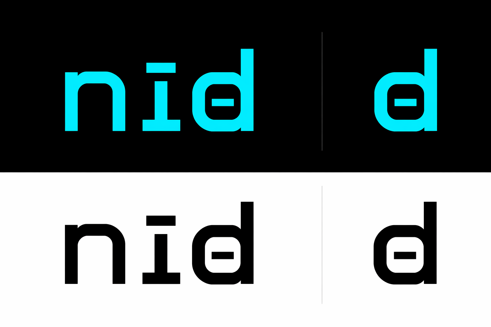

<p align="center">
  
</p>

# nid

**Your AI coding agent is burning tokens on output nobody reads.**

`cargo build` dumps 3,000 lines of `Compiling foo v0.1.0` the agent
never looks at. `pytest -v` ships full stack frames when a single
`test_x FAILED` line carried the signal. `docker logs`, `terraform
plan`, `git log`, `kubectl get pods`: every one of them bleeds context
window for noise. On real workloads this runs to dollars per session.

**nid compresses the noise out, losslessly where possible.**

A single Rust binary installs into your agent's PreTool hook. From that
moment on, every shell command the agent runs flows through nid. The
output that comes back is a structural subset of the original: lines
are kept, dropped, or collapsed. No rewrites, no hallucinations, no
lost error messages. Typical reduction: 60 to 90 percent. The raw
output stays in an encrypted local archive and is retrievable with one
command whenever the agent (or you) actually needs it.

### 20 pre-trained profiles, zero configuration

Day one ships with hand-tuned compression profiles for the commands
agents run most: `git status`, `git log`, `git diff`, `git branch -a`,
`cargo build`, `cargo test`, `pytest`, `npm install`, `docker ps`,
`kubectl get pods`, `terraform plan`, `tsc`, `eslint`, `ruff`, `mypy`,
`go test`, `jq .`, `psql`, `make`, `aws s3 ls`, `gh pr list`,
`az webapp log tail`. Every profile is backed by a byte-equal golden
fixture test that enforces real reduction. You get savings the moment
`nid onboard` finishes. No curation, no tuning.

### Learns new commands on the fly. Silently.

The profiles that ship are a floor. The first time your agent runs a
command nid has never seen, nid captures the output as a sample. After
five samples (three when the output is byte-identical across runs), a
structural-diff synthesizer generates a compression profile for that
specific command fingerprint, validates it against invariants derived
from the samples, and promotes it to active. The next invocation of
the same command hits the learned profile. An optional LLM refinement
step (Anthropic, local Ollama, or `claude` CLI) polishes the rules
further when a backend is available.

One-off `aws cloudfront get-distribution --id ...`? Profiles itself
after five invocations. Team-wide `terraform state list`? Picks up a
profile once anyone runs it enough times. Every new CLI the agent
touches joins the coverage set automatically.

**No approval prompts. No configuration. No telemetry. No manual
curation.** Synthesis is silent, self-tested against the training
samples before promotion, and reversible: `nid profiles rollback` is
one command away if a synthesized profile regresses.

### Safety built into the design

- **Compression is a structural subset of input.** Lines are kept,
  dropped, or collapsed. Lines are never rewritten. Error messages,
  exit indicators, and pattern matches are preserved as invariants the
  synthesizer is required to respect.
- **Learned profiles are declarative.** The DSL is TOML, interpreted
  in pure Rust with a bounded execution budget (10M steps, 2s
  wallclock, 64MB peak memory). No Wasm, no eval, no regex
  backreferences. A malicious profile imported from a third party
  cannot escape the interpreter.
- **Raw output is always preserved.** Stored AES-GCM-sealed with a
  machine-local key. Default reads re-redact on the fly. Secrets
  (AWS keys, GitHub PATs, JWTs, Stripe keys, SSH private keys, bearer
  tokens, high-entropy generic secrets) are redacted before the blob
  is sealed.
- **Signed releases, pinned anchors.** Every binary ships with an
  ed25519 anchor pubkey baked in. `nid update --from <tarball>`
  refuses to install anything the anchor cannot verify. Key rotation
  is supported via signed rotation records that chain back to the
  anchor.
- **Continuous fidelity validation.** Every compressed output runs
  through four tiers of checks: DSL invariants, structural subset,
  behavioral bypass-signal detection, and a quarantine path that
  retires any profile whose agents work around it.

### One binary. Eight agents. Works today.

Supports Claude Code, Cursor, Codex CLI, Gemini CLI, Copilot CLI,
Windsurf, OpenCode, and Aider out of the box. Install with `cargo
install --path crates/nid-cli` or download a signed release for your
platform. Run `nid onboard` once. Forget it exists. Check `nid gain`
in a week to see what you saved.

## Table of Contents

- [What nid does](#what-nid-does)
- [Quick start](#quick-start)
- [Install](#install)
- [Architecture](#architecture)
  - [Compression pipeline](#compression-pipeline)
  - [Fingerprinting (Scheme R)](#fingerprinting-scheme-r)
  - [Learning loop](#learning-loop)
  - [Fidelity measurement](#fidelity-measurement)
- [CLI reference](#cli-reference)
- [Configuration](#configuration)
- [Agent integration](#agent-integration)
- [Security model](#security-model)
  - [Raw storage](#raw-storage)
  - [Secret redaction](#secret-redaction)
  - [DSL sandboxing](#dsl-sandboxing)
  - [Release signing and anchor pinning](#release-signing-and-anchor-pinning)
- [Data model](#data-model)
- [DSL reference](#dsl-reference)
- [Releases](#releases)
- [Development](#development)
- [Contributing](#contributing)
- [License](#license)

## What nid does

> **For humans:** Your AI coding assistant runs shell commands and reads all
> the output. Most of that output is noise. nid shrinks each command's
> output to what actually matters before the assistant sees it, and keeps
> a full copy on your disk in case you ever want to look at it.

AI coding agents consume tokens linearly with the output of every shell
command they run. `cargo build`, `pytest -v`, `docker logs`,
`kubectl get pods`, `git log`, `terraform plan` routinely emit thousands
of lines the agent will never use. nid intercepts every shell command via
the agent's PreTool hook, rewrites the command to run through nid,
compresses the output structurally, and hands a compact version back to
the agent with an attestation footer. The raw output is always preserved
(optionally encrypted at rest) and retrievable with
`nid show <session-id>`.

```
your agent  ->  pytest -v       ->  PreTool hook  ->  nid pytest -v  ->  nid
                                                                           |
your agent  <-  compressed + attest <-  back through   <-  captured  <----+
```

See [Safety built into the design](#safety-built-into-the-design) above
for the invariants that keep the pipeline trustworthy.

## Quick start

> **For humans:** Install, onboard, forget about it. The examples below
> also show how to read saved output and check how much you've saved.

```bash
# Build from source (prebuilt binaries documented below).
cargo install --path crates/nid-cli

# Detect your agents and print what onboard would change.
nid onboard --check

# Install hooks into every detected agent config. Non-interactive for
# scripted use.
nid onboard --non-interactive

# At this point every shell command your agents run flows through nid.
# You can also invoke nid directly:
nid git status

# Read a prior session's raw output (redacted by default).
nid show <session-id>

# Token savings analytics.
nid gain

# Diagnostics: hook integrity, SQLite health, backend reachability.
nid doctor

# Roll everything back.
nid onboard --uninstall
```

## Install

> **For humans:** Two ways to install. Grab a prebuilt signed binary, or
> build from source with Cargo. The on-disk layout subsection tells you
> where nid keeps its config and database.

### Prebuilt release

> **For humans:** Every push to main publishes a fresh signed binary for
> Linux, macOS, and Windows. Download the one for your machine and let
> nid verify it before installing.

Releases are published on every push to `main` (rolling `main` channel)
and on every `v*.*.*` tag (versioned channel). Each release carries one
signed `.nidrel` tarball per target triple:

- `nid-x86_64-unknown-linux-musl.nidrel`
- `nid-aarch64-unknown-linux-gnu.nidrel`
- `nid-x86_64-apple-darwin.nidrel`
- `nid-aarch64-apple-darwin.nidrel`
- `nid-x86_64-pc-windows-msvc.nidrel`

Every `.nidrel` is ed25519-signed. Before installing, verification runs
against the release anchor pinned into your existing `nid` binary. For
the initial install on a machine that has no `nid` binary, pass
`NID_RELEASE_ALLOW_UNANCHORED=1`, documented under
[Releases](#releases).

```bash
curl -LO https://github.com/newtro/nid/releases/latest/download/nid-x86_64-unknown-linux-musl.nidrel
nid update --from nid-x86_64-unknown-linux-musl.nidrel
```

### From source

> **For humans:** If you have Rust installed, one `cargo install` command
> builds nid locally.

Requires a stable Rust toolchain 1.80 or newer.

```bash
cargo install --path crates/nid-cli
```

### On-disk layout

> **For humans:** This is where nid keeps its files. Config in one place,
> database and saved output in another. Everything stays inside these
> two directories.

After onboarding, nid writes to:

```
~/.config/nid/
  config.toml              user config (optional; defaults if missing)
  onboard.backup.json      byte-perfect original configs per agent
  hooks/                   per-agent hook scripts
  shadow.state             "enable" flips the hook into shadow mode

~/.local/share/nid/        XDG on Linux; Application Support on macOS
  nid.sqlite               WAL-mode SQLite, 11 tables (Data model)
  blobs/
    sha256-<hash>.zst      content-addressed blobs: dsl, sample,
                           compressed, raw. Raw blobs are AES-GCM-sealed.
  key                      AES-GCM raw-blob key (0600 on Unix)
  synth_locks/             advisory locks for auto-synthesis races
  show_access.log          audit trail for `nid show --raw-unredacted`
  .last_gc_day             opportunistic-GC marker
  .last_retention_day      retention-purge marker
```

## Architecture

> **For humans:** nid is split into eight small libraries plus one binary.
> Each library has a single responsibility. The table below is a short
> tour of what each one is for.

8-crate Cargo workspace:

| Crate | Responsibility |
|---|---|
| [`nid-cli`](crates/nid-cli) | Binary. `clap` argv parsing, subcommand plumbing. |
| [`nid-core`](crates/nid-core) | `Compressor` trait, `Context`, Scheme R fingerprint, redaction, AES-GCM sealed blobs, ed25519 signing, Layer 1 and 2 native layers. |
| [`nid-dsl`](crates/nid-dsl) | AST (14 rule kinds, 6 invariant checks), grammar validator, streaming interpreter, execution budget, structural-diff synthesizer, `.nidprofile` tarball format. |
| [`nid-storage`](crates/nid-storage) | SQLite (11 tables), migrations, content-addressed zstd blob store, repo modules per table, config reader. |
| [`nid-hooks`](crates/nid-hooks) | Per-agent hook writers, detection, rewrite rules, onboard plan / apply / uninstall. |
| [`nid-fidelity`](crates/nid-fidelity) | Invariant checks, structural-subset check, bypass signal taxonomy, exit-code skew detection. |
| [`nid-synthesis`](crates/nid-synthesis) | `Backend` trait, Anthropic / Ollama / claude-CLI backends, lock-in policy, synthesis orchestrator. |
| [`nid-profiles`](crates/nid-profiles) | Bundled Layer 3 profiles. `build.rs` compiles `profiles/*.toml` into the binary. |

### Compression pipeline

> **For humans:** Every command runs through two passes. The first pass
> strips universal junk like color codes and duplicate lines. The second
> pass applies a rule set picked for that specific command, either a
> learned one or a hand-written one that ships with nid.

Two-tier hierarchical dispatch. Tier A always runs. Tier B picks exactly
one implementation based on priority.

Tier A: Layer 1 generic cleanup (native Rust, always on):

- Dedup adjacent identical lines.
- Strip ANSI escape sequences.
- Strip carriage returns.
- Optional head and tail truncation envelope.

Tier B: exactly one of these runs, in priority order.

| Layer | When | Source |
|---|---|---|
| Layer 5: learned profile | A persisted profile exists for this fingerprint | Synthesized from captured samples, stored as a DSL blob |
| Layer 3: bundled profile | No learned profile; fingerprint matches a shipped starter | Hand-tuned DSL files under `profiles/` |
| Layer 2: format-aware | No profile at all | Native Rust. Detects JSON, NDJSON, unified diff, stack trace, tabular, log, plain. Drops DEBUG and TRACE for logs. Passes through for other formats. |
| Layer 4: small-LLM catch-all | Reserved for v1.1 | Not shipped. Layer 2 is the v1 fallback. |

The hot path lives in [`crates/nid-cli/src/cmd/run.rs`](crates/nid-cli/src/cmd/run.rs).
Roughly:

1. Fingerprint argv (Scheme R).
2. Install SIGTERM trap. On Unix this uses `signal::terminate`. On
   Windows it uses `ctrl_break`. Partial output survives interrupts and
   is marked with a terminal marker.
3. Opportunistic blob-orphan GC (once per calendar day, time-bounded).
4. Load `config.toml` (defaults on missing or malformed).
5. Resolve profile in order: Layer 5 persisted, then Layer 3 bundled.
6. Spawn the wrapped command via `sh -c` or `cmd /C`. Capture is bounded
   by `session.max_total_mb` (default 2 GiB). Truncation is marked.
7. Redact secrets before persistence. `deny_commands` triggers an
   aggressive extra sweep. `allow_commands` opts out.
8. Run Layer 1 streaming cleanup.
9. Run Layer 3 or 5 DSL (budgeted). Otherwise run Layer 2 format pass.
10. AES-GCM-seal the unredacted raw with the machine-local key and
    persist to the blob store when `preserve_raw=true`.
11. If no profile matched, capture a sample for the fingerprint. If the
    sample count crossed the lock-in threshold (default N=5; fast path
    N=3 when samples are byte-identical), run synthesis under a
    per-fingerprint advisory lock.
12. Tier 1 (DSL invariants), Tier 2 (structural subset), and Tier 4
    (bypass signal) fidelity checks. Quarantine the profile when the
    rolling score exceeds threshold or the DSL budget aborted.
13. Write the session row, bump `gain_daily`, run opportunistic
    retention purge.
14. Emit compressed output plus the attestation footer.

### Fingerprinting (Scheme R)

> **For humans:** nid needs to recognize when two commands are "the same
> command with different arguments" so it can reuse the same rules.
> Fingerprinting turns `git show abc1234` and `git show def5678` into the
> same identifier by replacing the hash with a placeholder.

A stable fingerprint is the binary basename plus the canonicalized argv
tail.

| argv token | becomes |
|---|---|
| path-like (`./foo`, `/etc/hosts`, `C:\bin\x.exe`, `src/foo.rs`) | `<path>` |
| number (`42`, `-0.1`) | `<n>` |
| hex hash, 6 or more chars (`abc1234`, `0xdeadbeef`) | `<hash>` |
| URL | `<scheme>://<host>` with path and query dropped |
| quoted-string-positional (contains whitespace) | `<str>` |
| flag name (`--output`, `-v`) | kept verbatim |
| flag value | collapsed via the same rules, except for shape-defining flags (`--format`, `--output`, `-o`, `--json`, `--pretty`, `--oneline`) where the value is kept literal |

Examples:

| argv | fingerprint |
|---|---|
| `git status` | `git status` |
| `git log -n 20` | `git log -n <n>` |
| `git show abc1234` | `git show <hash>` |
| `cat src/foo.rs` | `cat <path>` |
| `curl https://api.example.com/v1/users?x=1` | `curl https://api.example.com` |
| `cargo build --output=json` | `cargo build --output=json` |

Progressive splitting (`profiles.parent_fp` with `profiles.split_on_flag`)
is planned for v1.1. In v1 there is one profile per fingerprint.

### Learning loop

> **For humans:** When nid sees a command it doesn't recognize, it watches
> a few runs, works out which lines are always the same and which change,
> and writes its own compression rules. A language model can optionally
> polish those rules. The next run of the same command gets the learned
> rules automatically.

On an unknown fingerprint, nid:

1. Captures the raw output as a sample. The sample itself is redacted
   before persistence. The separate `raw_` blob is sealed-unredacted.
   Capped at 64 samples per fingerprint.
2. On each capture, consults `lockin::should_lock_in`:
   - `samples.len() >= samples_to_lock` (default 5), or
   - `samples.len() >= 3 && zero_variance(samples)` (fast path).
3. On lock-in, acquires a per-fingerprint filesystem lock under
   `<data>/synth_locks/`. This prevents races between concurrent nid
   invocations. It re-checks whether a profile was just promoted by a
   racing process, then runs the synthesis orchestrator.
   - Structural-diff pre-pass (always runs): line-align samples,
     classify lines as Constant or Varying, emit `keep_lines` anchors,
     `dedup`, `drop_lines ^\s*$`, and a `truncate_to` floor. Adds
     invariants for `(?i)(error|fatal|panic|traceback)` lines and
     `ExitLinePreserved`.
   - LLM refinement (when a backend is configured via
     `ANTHROPIC_API_KEY`, a local Ollama daemon at `OLLAMA_HOST`, or a
     `claude` CLI on PATH): sends samples plus baseline DSL plus
     invariants to the backend; expects improved DSL as TOML. The
     result is validated, sandboxed-budget self-tested on every sample,
     and rejected on any invariant failure.
4. On pass, the profile is inserted as `pending` and promoted to
   `active` atomically in the same transaction. The previous active
   profile for the same fingerprint is flipped to `superseded`.
5. The next invocation of the same command hits the learned Layer 5
   profile.

Re-synthesis triggers:

- DSL execution budget aborted: quarantine, re-synthesize on next lock-in.
- Rolling bypass score above `fidelity.bypass_threshold`: quarantine.
- Exit-code skew above 2x between success and failure buckets with at
  least 50 samples in each bucket.
- `nid synthesize <cmd> --force` manual trigger.

### Fidelity measurement

> **For humans:** Compression has to keep the important signal intact. nid
> runs four kinds of checks on every compressed output: regex invariants,
> structural-subset checks, sampled judge-model scoring, and behavioral
> signals that reveal when an agent is working around the compression.
> Profiles that fail these checks get retired automatically.

Four tiers:

| Tier | Cost | Frequency | Detects |
|---|---|---|---|
| T1 invariants (regex and JSON-path checks) | free | every run | Exit line dropped, error line dropped, required pattern count below floor |
| T2 structural subset | cheap (line-set check) | every run | Profile inventing content not present in raw |
| T3 judge-model sampling | 1 percent budgeted | sampled | Subtle semantic loss (v1.1) |
| T4 behavioral (bypass signals) | free | continuous | Agent re-fetching raw, running a script equivalent, grepping after read |

Bypass signals are weighted and aggregated into a rolling 100-session
score per profile with a 3-session warmup:

| Signal | Weight |
|---|---|
| Raw re-fetch | 0.9 |
| Explicit `nid show` or raw-escape | 0.7 |
| Script-to-disk-then-run heuristic | 0.6 |
| grep-after-read | 0.5 |
| Near-duplicate re-invocation within 30s | 0.4 |
| `NID_RAW=1` explicit raw | 0.2 |

The denominator is all recent sessions (clean or dirty). A single
`GrepAfterRead` in a window of 50 clean runs yields 1/50, never 1.0.
Per-session weight caps at 1.0.

## CLI reference

> **For humans:** Everything nid can do from the command line. The one
> you'll use most is `nid <command>` because that is what the agent hook
> calls. The rest are for reading saved output, inspecting profiles,
> tweaking settings, and keeping the install healthy.

### `nid <command...>`

Runs `<command...>` through the compression pipeline. This is what the
hook rewrites to. You can also invoke it directly. Exit code equals the
wrapped command's exit code.

```
nid pytest -v
nid cargo build
nid 'pytest | tee log.txt | grep FAIL'
```

Flags:

- `--shadow`: shadow mode for this invocation. Raw output is returned.
  The compressed counterfactual is stored without being emitted.

### `nid onboard [flags]`

Detects installed agents plus LLM backends, writes hook integrations.

Flags:

- `--non-interactive`: no prompts. Applies with flag and env defaults.
- `--check`: detect-only. Prints what would change. CI-friendly.
- `--reconfigure`: re-detect, rewrite hooks, preserve data.
- `--uninstall`: restore original configs byte-perfect from
  `onboard.backup.json`. Preserves data.
- `--uninstall --purge`: uninstall then delete `~/.config/nid/` and
  `~/.local/share/nid/`.
- `--agents <list>`: comma-separated from `claude_code`, `cursor`,
  `codex_cli`, `gemini_cli`, `copilot_cli`, `windsurf`, `opencode`,
  `aider`.
- `--disable-synthesis`: install hooks; never call LLM backends.
- `--budget <usd>`: override the daily LLM budget (default 0.50 USD).

### `nid show <session-id> [--raw-unredacted]`

Emits a prior session's raw output. Default path unseals and applies
`redact::redact` on the fly. `--raw-unredacted` skips the redact pass. It
requires interactive `yes` confirmation on a tty (or
`NID_UNREDACTED_OK=1` for scripted use) and appends an access entry to
`<data>/show_access.log`.

### `nid sessions [--limit N]`

Lists recent sessions newest-first. Columns: id, fingerprint, exit code,
raw bytes, compressed bytes, mode.

### `nid profiles <subcommand>`

- `list`: bundled plus persisted.
- `inspect <fingerprint>`: pretty-prints the profile DSL.
- `export <fingerprint> <output.nidprofile> [--key <path>]`: packs as a
  signed tarball. Without `--key`, generates an ephemeral key and prints
  the key-id. Persist the generated private key yourself if you plan to
  re-sign.
- `import <path.nidprofile> [--allow-unsigned]`: verifies signer against
  the trust keyring, unpacks, promotes. `--allow-unsigned` requires
  `yes` confirmation or `NID_UNTRUSTED_OK=1`.
- `pin <fingerprint>`: mark a profile version pinned (prevents auto
  re-synthesis).
- `revoke <fingerprint>`: quarantine the active profile.
- `rollback <fingerprint>`: flip the most-recent superseded profile back
  to active.
- `purge <fingerprint>`: hard-delete every row for that fingerprint and
  release referenced blobs.
- `sign <tarball> --key <path>`: re-sign an existing tarball with an
  organizational key.

### `nid trust <subcommand>`

- `add <key-path> [--label <label>]`: add a public key to the import
  trust keyring.
- `revoke <key-id>`: revoke a key. Previously imported profiles signed
  by it remain. Future imports are refused.
- `list`: active trusted keys.

### `nid synthesize <cmd...> [--force]`

Manually trigger profile synthesis for a fingerprint. Useful when the
auto-path is cooldown-gated. `--force` bypasses the 24-hour per-profile
refinement cooldown.

### `nid gain [--shadow] [--per-million-usd <f>] [--top N]`

Savings analytics. Totals plus per-fingerprint breakdown by tokens
saved. `--shadow` filters to shadow-mode sessions (counterfactual
savings). `--per-million-usd` defaults to 15.00 (the Opus 4.7
input-token rate).

### `nid shadow <enable|disable|commit|status>`

Trust-ramped rollout.

- `enable`: hook rewrites `<cmd>` to `nid --shadow <cmd>`. The agent
  sees raw output. Compressed counterfactual is captured.
  `nid gain --shadow` reports projected savings.
- `commit`: disable shadow. Compression is live.
- `disable`: disable shadow without committing. Stops counterfactual
  collection.
- `status`: current state.

### `nid gc [--retention-days N] [--dry-run]`

Purges sessions older than N days (default 14), releases their raw and
compressed blobs, sweeps blob-store orphans. An opportunistic bounded
variant runs once per calendar day from any `nid <cmd>` invocation.

### `nid doctor`

Diagnostics:

- SQLite: open, schema version, round-trip test row.
- Blob store: put, get, release round-trip.
- Backends: env-var check for Anthropic, TCP probe for Ollama, PATH
  probe for `claude` CLI.
- Hook integrity: re-hash each registered agent config. Reports DRIFT
  when SHA-256 changed since install. Detects co-installed PreTool Bash
  hooks from other tools.
- On Unix: warns when `config_dir`, `data_dir`, or `blobs_dir` perms
  are not 0700.
- Shows the last five `show_access.log` entries.

### `nid update [flags]`

Install a new nid binary from a signed `.nidrel` tarball.

Flags:

- `--check`: hits the GitHub releases API and prints current vs
  latest.
- `--from <path>`: verify and swap from a local tarball. Offline path.
- `--channel <stable|beta|nightly>`: release channel (cosmetic in v1).
- `--dry-run`: verify without swapping.
- `--to <version>`: explicit version (v1.1).

Every install enforces these checks:

1. Version byte plus tar structure (`nid`, `manifest.json`,
   `signature.bin`, `signer.pub`).
2. `signature.bin` verifies over `manifest.json` using `signer.pub`.
3. `sha256(nid)` equals `manifest.binary_sha256`.
4. `manifest.signer_key_id` equals the shipped release anchor, or is
   reachable via `manifest.rotation_chain` from the anchor.

When the build has no anchor pinned (dev build or `cargo install`), the
installer refuses by default. Set `NID_RELEASE_ALLOW_UNANCHORED=1` to
opt in for non-production use.

### `nid version`

Prints the current version and update channel.

### Hidden: `nid __hook <agent>`

Stdin and stdout protocol handler invoked by agent hook configs.
Accepts the relevant PreTool JSON shape per agent, applies the rewrite
rules (idempotent, whole-pipeline wrap, builtin + tee + cat
passthrough, shadow prefix), emits `{updatedInput, additionalContext}`.

## Configuration

> **For humans:** nid works out of the box with zero config. If you want
> to tweak something, drop a `config.toml` in the path below. Every field
> is optional and has a sensible default.

`~/.config/nid/config.toml`. All fields are optional. Missing keys take
defaults. A malformed file logs a warning and falls back to defaults. nid
never refuses to start on config errors.

```toml
[security.redaction]
# Additional regex patterns applied after built-ins. Invalid regexes
# are skipped.
extra_patterns = [
  "SECRET-[A-Z0-9]{8}",
  "internal-token-[a-f0-9]{32}",
]
# Commands (argv[0] basename) that get an aggressive extra
# high-entropy sweep on top of the built-in patterns. Wins over
# allow_commands.
deny_commands = ["env", "printenv", "aws", "kubectl"]
# Commands that skip built-in redaction entirely. Use sparingly.
allow_commands = []

[session]
# Persist raw output? Default true. Shadow mode always persists.
preserve_raw = true
# Sessions older than N days get their raw and compressed blobs released
# by `nid gc` and the opportunistic daily sweep.
retention_days = 14
# Cap per-invocation output capture in MiB. 0 disables. Half is
# allocated to stdout, half to stderr. The child is drained on overflow
# so it does not block.
max_total_mb = 2048
# Commands whose raw is never persisted regardless of preserve_raw.
deny_raw_commands = []
# Commands whose raw IS persisted even when preserve_raw=false.
allow_raw_commands = []

[hook]
# Extra regex patterns that match commands to pass through (beyond the
# built-in builtins and tee + cat + as-plumbing list).
passthrough_patterns = [
  '^secret-internal-tool\b',
]

[synthesis]
samples_to_lock = 5
fast_path_if_zero_variance = true
daily_budget_usd = 0.50
per_profile_refinement_cooldown_hours = 24

[fidelity]
bypass_threshold = 0.3
bypass_warmup_runs = 3
judge_sample_rate = 0.01
```

## Agent integration

> **For humans:** Each AI coding tool has its own way of hooking into
> shell commands. nid ships with the glue for eight of them. You don't
> need to read any of the hook formats; `nid onboard` wires everything
> up.

nid supports 8 AI coding agents out of the box:

| Agent | Config file | Hook mechanism |
|---|---|---|
| Claude Code | `~/.claude/settings.json` | `PreToolUse` `Bash` matcher. Emits `updatedInput` without `permissionDecision`, which works around an upstream bypass-permissions bug |
| Cursor | `~/.cursor/hooks.json` | `beforeShellExecution` |
| Codex CLI | `~/.codex/hooks.json` | `PreToolUse` (Bash-only) |
| Gemini CLI | `~/.gemini/hooks.json` | `BeforeTool` |
| Copilot CLI | `~/.github-copilot/hooks.json` | `preToolUse` |
| Windsurf | `~/.codeium/windsurf/hooks.json` | `preCascade` |
| OpenCode | `~/.config/opencode/hooks.json` | `before_tool_call` |
| Aider | `~/.aider.conf.yml` | Config-file wrapper. Aider has no per-invocation API. |

Installation (`nid onboard --non-interactive`) merges nid's entry into
each agent's config and preserves other keys. It records the resulting
SHA-256 in the `agent_registry` table and backs up the original to
`~/.config/nid/onboard.backup.json` for byte-perfect uninstall.

Rewrite rules applied by every agent's hook:

1. Idempotent. `nid nid <cmd>` collapses to `nid <cmd>`. A command that
   already starts with `nid ` or a path that resolves to the `nid`
   binary passes through unchanged.
2. Whole-pipeline wrap. `pytest | tee log.txt | grep FAIL` becomes
   `nid 'pytest | tee log.txt | grep FAIL'`. Pipelines are wrapped as a
   unit with no per-stage wrapping.
3. Passthrough list. Shell builtins (`cd`, `export`, `set`, `unset`,
   `alias`, `source`, `.`, `eval`, `pwd`, `echo`, `printf`, `read`,
   `exit`, `return`) are never wrapped. Pure-plumbing `tee` and `cat`
   uses with redirects are never wrapped. User-configured
   `hook.passthrough_patterns` are never wrapped.
4. `NID_RAW=1` escape. `NID_RAW=1 pytest` unwraps back to raw for that
   one invocation.
5. Shadow-mode toggle. When `shadow.state` equals `enable`, every hook
   response sets the `shadow` bit. `run.rs` then emits the redacted raw
   output instead of the compressed form.

### Aider caveat

> **For humans:** Aider is the one agent that doesn't expose a
> per-command hook, so nid's integration there is weaker. If you
> override Aider's config on the command line, nid is silently skipped
> for that session.

Aider has no per-invocation hook API. nid's integration wraps the user's
`.aider.conf.yml` with a `shell-command-prefix: "nid"` key. If you reset
that config or launch Aider with CLI overrides that bypass the config,
nid is silently skipped for that session. `nid doctor` detects missing
Aider config when the Aider binary is on PATH.

### Claude Code bypass-permissions quirk

> **For humans:** This is a note for contributors touching the hook
> code. If you are just using nid, you can skip it.

Claude Code has an upstream bug where `updatedInput` is silently dropped
when combined with `permissionDecision` under bypass-permissions mode.
nid's handler always emits `updatedInput` alone to work around this. Do
not re-introduce a `permissionDecision` field without re-testing the
bypass-permissions path.

## Security model

> **For humans:** nid stores your shell output and builds compression
> rules on your behalf. This section explains how that storage is
> protected, how secrets are scrubbed before anything is saved, why the
> compression rules cannot do anything scary, and how release binaries
> prove they came from this project.

### Raw storage

> **For humans:** Saved shell output is encrypted with a key that lives
> on your machine. If you back up the database without the key, the
> backup cannot be read, and nid will refuse to silently drop the old
> data to paper over that.

Raw output is stored unredacted and AES-GCM-sealed with a machine-local
32-byte key at `~/.local/share/nid/key`. Unix permissions are 0600. On
Windows the file inherits the user profile's default ACL.

Layout of each sealed blob:

```
version(1 byte) || nonce(12 bytes) || ciphertext+auth_tag
```

`nid show` decrypts on read. The default path re-applies
`redact::redact` as defense in depth. `--raw-unredacted` skips the
redact pass, requires `yes` confirmation on a tty (or
`NID_UNREDACTED_OK=1`), and appends to `show_access.log`.

Key-loss safety: if the key file is missing, truncated, or wrong-size
AND sealed blobs already exist, nid refuses to regenerate. Recovery
options are:

1. Restore the key file from backup.
2. Run `nid gc --retention-days 0` to purge the now-unreadable blobs.
3. Delete the key file AND clear the sealed-raw blobs manually.

This prevents silently orphaning every prior raw output after an
incomplete backup restore.

### Secret redaction

> **For humans:** Before any output is saved to disk, nid scrubs out
> anything that looks like an API key, password, or token. You can add
> your own patterns. For especially sensitive commands you can force an
> even more aggressive sweep.

Applied before the raw blob is sealed. The sealed payload therefore
cannot contain secrets unless a pattern failed to match. Built-in
patterns:

| Name | Pattern |
|---|---|
| `aws_access_key` | `AKIA[0-9A-Z]{16}` |
| `github_pat_classic` | `ghp_[A-Za-z0-9]{36,}` |
| `github_pat_fine` | `github_pat_[A-Za-z0-9_]{40,}` |
| `gitlab_token` | `glpat-[A-Za-z0-9_-]{20,}` |
| `stripe_live` | `sk_live_[A-Za-z0-9]{20,}` |
| `stripe_test` | `sk_test_[A-Za-z0-9]{20,}` |
| `jwt` | `eyJ...\.eyJ...\.[A-Za-z0-9_.+/=-]{10,}` |
| `bearer_header` | `(?i)(authorization\|auth)\s*:\s*bearer\s+[A-Za-z0-9._~+/=-]{20,}` |
| `ssh_private_key_block` | `-----BEGIN ... PRIVATE KEY-----[\s\S]*?-----END ... PRIVATE KEY-----` |
| `high_entropy` | heuristic: `\b[A-Za-z0-9_+/=-]{32,}\b` with Shannon entropy greater than 4.5 |

Each match is replaced with `[REDACTED:<name>]`.
`security.redaction.extra_patterns` adds more. `deny_commands` forces
an additional `\b[A-Za-z0-9_+/=-]{24,}\b` sweep marked
`[REDACTED:deny]`.

### DSL sandboxing

> **For humans:** Compression rules are declarative data. The interpreter
> has no way to read files, open sockets, or run programs. Each rule set
> also has strict time and memory budgets; anything that goes over gets
> killed and the rule set retired.

The DSL grammar has no IO, subprocess, filesystem, eval, or network
primitives. The validator additionally rejects:

- Regex backreferences (`\1` through `\9`). The Rust `regex` crate
  refuses them natively. nid pre-checks for a clearer error message.
- JSON-path wildcards (`*`, `..`, filter expressions). Only simple
  `$.a.b[0].c` walks are allowed.
- Empty state-machines, duplicate state names, duplicate invariant
  names, zero head, tail, or truncate_to values, and
  `collapse_repeated` min below 2.

Per-run execution budget (enforced in
[`nid-dsl/src/budget.rs`](crates/nid-dsl/src/budget.rs)):

| Budget | Default | Enforcement |
|---|---|---|
| `max_steps` | 10,000,000 | checked per-line |
| `max_wallclock_ms` | 2,000 | checked every 1024 steps |
| `max_peak_bytes` | 64 MiB | checked per-rule |

Budget overrun aborts the DSL pass. The pipeline degrades to Layer-1
output. The profile is quarantined (status flipped to `quarantined`)
and a `dsl_budget_exceeded` fidelity event is recorded.

Auto-synthesized profiles that abort the budget on any of their own
training samples are rejected before promotion.

### Release signing and anchor pinning

> **For humans:** Every release is cryptographically signed. Your
> installed binary remembers the project's signing key and refuses to
> upgrade to anything that key didn't sign. When the project rotates
> keys, the rotation itself is signed, so the chain of trust stays
> intact.

Every `.nidrel` release tarball contains:

- `nid`: the compiled binary.
- `manifest.json`: `{version, signer_key_id, target, binary_sha256,
  signed_at, rotation_chain}`.
- `signature.bin`: ed25519 signature over `manifest.json`.
- `signer.pub`: 32-byte raw pubkey of the signer.

Verification steps (in
[`nid-cli/src/cmd/update.rs`](crates/nid-cli/src/cmd/update.rs)):

1. Parse manifest, compute sha256 of the binary, bail on mismatch.
2. Verify `signature.bin` against `signer.pub`.
3. Compare `manifest.signer_key_id` to the anchor pubkey baked into
   the current `nid` build via `NID_RELEASE_ANCHOR_HEX`. If equal,
   proceed.
4. If not equal, walk `manifest.rotation_chain` starting from the
   anchor. Each link is an ed25519 attestation signed by the
   predecessor key. If a valid path reaches `manifest.signer_key_id`,
   proceed. Otherwise bail.
5. If no anchor is baked in (dev build), refuse unless
   `NID_RELEASE_ALLOW_UNANCHORED=1` is set.

Generate a signing key:

```bash
cargo run --release --bin nid-keygen > private-key.hex
# stderr reports: key_id + pubkey hex. Use these to set
# NID_RELEASE_ANCHOR_HEX in the next nid build.
```

Pack a signed release manually:

```bash
cargo run --release --bin nid-package -- \
  --binary target/x86_64-unknown-linux-musl/release/nid \
  --version 0.1.0 \
  --target x86_64-unknown-linux-musl \
  --output nid-x86_64-unknown-linux-musl.nidrel \
  --signing-key-hex "$(cat private-key.hex)"
```

The GitHub Actions release workflow handles all of this automatically
from the `NID_RELEASE_SIGNING_KEY` repo secret.

## Data model

> **For humans:** nid uses a single SQLite file to track everything it
> knows about your commands, sessions, learned profiles, and savings.
> The table below is a short tour of what each table is for.

Eleven-table SQLite schema. Full DDL in
[`crates/nid-storage/src/sql/001_initial.sql`](crates/nid-storage/src/sql/001_initial.sql).

| Table | Purpose |
|---|---|
| `meta` | Schema version, nid version, install time |
| `profiles` | One row per profile version. Dispatch index |
| `blobs` | Content-addressed blob registry, ref-counted |
| `samples` | Raw samples used for synthesis (redacted) |
| `sessions` | One row per `nid <cmd>` invocation |
| `fidelity_events` | Invariant checks, judge scores, bypass signals, exit-skew events |
| `synthesis_events` | Every synthesis attempt: backend, outcome, cost, duration |
| `gain_daily` | Denormalized rollup of savings per UTC date |
| `trust_keys` | Organizational profile-sharing trust keyring |
| `profile_import_events` | Audit trail for profile imports |
| `agent_registry` | Hook paths and SHA-256s per installed agent. `nid doctor` uses this for drift detection |

Schema is applied via a forward-only migration runner
([`crates/nid-storage/src/migrations.rs`](crates/nid-storage/src/migrations.rs)).
A DB version newer than the binary refuses to open.

Blobs live under `<data>/blobs/sha256-<hash>.zst` (zstd-compressed). The
blob kind is stored only in the `blobs` table row. Ref-count is
maintained by application code rather than SQLite triggers in v1.
`nid gc` cleans orphans.

SQLite is opened in WAL mode with `busy_timeout=500ms`. Encryption is
per-blob AES-GCM on raw blobs only. SQLite itself is vanilla (no
SQLCipher).

## DSL reference

> **For humans:** Compression rules are written in TOML. A rule set is a
> list of small declarative steps (drop these lines, keep those, stop
> repeating) plus a list of things that must still be true when the
> rules finish running. The example below is a real rule set for
> `git status`.

Full reference in [`docs/dsl-reference.md`](docs/dsl-reference.md).
Quick tour:

```toml
[meta]
fingerprint = "git status"
version     = "1.0.0"
schema      = "1.0"
format_claim = "plain"

[[rules]]
kind = "strip_ansi"

[[rules]]
kind  = "keep_lines"
match = '^(On branch |Your branch|Changes |Untracked |nothing to |no changes )'

[[rules]]
kind  = "drop_lines"
match = '^\s*\(.*\)\s*$'

[[rules]]
kind = "dedup"

[[invariants]]
name    = "BranchLinePreserved"
check   = "first_line_matches"
pattern = "^(On branch |HEAD detached|Your branch)"
```

14 rule kinds:

- `keep_lines`
- `drop_lines`
- `collapse_repeated`
- `collapse_between`
- `head`
- `tail`
- `head_after`
- `tail_before`
- `dedup`
- `strip_ansi`
- `json_path_keep`
- `json_path_drop`
- `ndjson_filter`
- `state_machine`
- `truncate_to`

6 invariant checks:

- `last_line_matches`
- `first_line_matches`
- `all_matching_preserved`
- `count_matches_at_least`
- `json_path_exists`
- `exit_line_preserved`

### Bundled profiles

> **For humans:** These are the commands that ship with hand-written
> rule sets out of the box. Anything else gets a learned rule set on the
> fly.

20 profiles in [`profiles/`](profiles):

`git status`, `git log`, `git diff`, `git branch -a`, `cargo build`,
`cargo test`, `pytest`, `npm install`, `docker ps`, `kubectl get pods`,
`jq .`, `go test`, `tsc`, `eslint`, `ruff check <path>`, `mypy <path>`,
`terraform plan`, `aws s3 ls`, `gh pr list`, `psql`, `make`,
`az webapp log tail`.

Each ships with a fixture pair at
[`tests/fixtures/<slug>/`](tests/fixtures). Byte-equal golden tests
gate every change. A `compression_ratios.rs` guardrail additionally
asserts that every non-identity fixture demonstrates real byte
reduction (no test-theatre).

## Releases

> **For humans:** Every push to main produces a fresh set of signed
> binaries. Tagged versions work the same way and stay around
> permanently. This section documents the pipeline for anyone forking
> the repo or debugging the release workflow.

CI ([`.github/workflows/ci.yml`](.github/workflows/ci.yml)) runs on
every push and pull request:

- `cargo fmt --all --check`
- `cargo clippy --workspace --all-targets -- -D warnings`
- `cargo build --workspace --all-targets`
- `cargo test --workspace --all-targets`

Matrix: ubuntu-latest, macos-14, windows-latest.

Release ([`.github/workflows/release.yml`](.github/workflows/release.yml))
fires on:

- Push to `main`: rolling pre-release tagged `main`, version
  `0.0.0-main.<sha>`. The `main` tag is force-moved to the pushed
  commit. The previous release is deleted so the asset set stays
  current.
- Tag push `v*.*.*`: versioned release. Marked `latest`.
- `workflow_dispatch`: manual. Pass a tag as input.

Every release builds five targets:

- `x86_64-unknown-linux-musl`
- `aarch64-unknown-linux-gnu` (cross-compiled with
  `gcc-aarch64-linux-gnu`)
- `x86_64-apple-darwin`
- `aarch64-apple-darwin`
- `x86_64-pc-windows-msvc`

Each target produces a `.nidrel` signed tarball. All five are uploaded
to the same GitHub release. The packager runs on the host rather than
cross-compiled, so the release workflow works for all targets without
per-arch tooling.

### Required repo secret

> **For humans:** To publish releases from your own fork, generate a
> signing key and paste it into a GitHub secret. Steps below.

`NID_RELEASE_SIGNING_KEY`: 64 hex chars equal to a 32-byte ed25519 seed.
The release workflow fails with a clear error when this is missing.
Generate with:

```bash
cargo run --release --bin nid-keygen
```

Set via the `gh` CLI:

```bash
gh secret set NID_RELEASE_SIGNING_KEY --body "$(cat private-key.hex)"
```

Or use the repo Settings UI.

### Release anchor

> **For humans:** If you want users of your build to automatically trust
> your release key, bake the public key into the binary at build time.
> Skip this and users have to opt in to unanchored installs with an
> environment variable.

For production releases, bake the release pubkey into every `nid` build
so the install path can verify signer identity without out-of-band
trust:

```bash
NID_RELEASE_ANCHOR_HEX="<64 hex chars of your ed25519 pubkey>" \
  cargo build --release --bin nid
```

The release workflow does not set this by default. Setting it would
embed the current-key anchor into every build, which is the point. For
rolling `main` builds that get installed by downstream CI, either:

1. set `NID_RELEASE_ANCHOR_HEX` at build time in the workflow, or
2. have downstream `nid update --from` callers set
   `NID_RELEASE_ALLOW_UNANCHORED=1`.

## Development

> **For humans:** Standard cargo workflow. Build, test, lint, format.
> The notes at the bottom cover a couple of testing quirks.

```bash
# Clone and build everything.
git clone https://github.com/newtro/nid.git
cd nid
cargo build --workspace

# Run all tests.
cargo test --workspace

# Lint and format checks (CI parity).
cargo clippy --workspace --all-targets -- -D warnings
cargo fmt --all --check

# Run a single test.
cargo test --workspace -p nid-dsl nidprofile
```

Test scaffolding notes:

- Integration tests in `crates/nid-cli/tests/e2e.rs` spawn the compiled
  `nid` binary under `NID_CONFIG_DIR` and `NID_DATA_DIR` overrides so
  no state leaks to the dev machine.
- Fixture-based golden tests in `crates/nid-profiles/tests/golden_all.rs`
  auto-discover every `tests/fixtures/<slug>/` directory and assert
  byte-equal compression output.
- The `compression_ratios.rs` guardrail prevents fixtures from
  regressing into no-ops.

## Contributing

> **For humans:** Fork, branch, open a PR. CI on three platforms has to
> pass before anything merges. Add tests for new behavior.

The repository is public. The `main` branch is protected. Open a pull
request from a fork or a topic branch. CI must pass (`fmt`,
`clippy -D warnings`, `test` on all three OSes) before a PR can be
merged.

Before opening a PR:

- Run `cargo fmt --all` and `cargo clippy --workspace --all-targets`
  locally.
- Update `CHANGELOG.md` under `## [Unreleased]`.
- Add tests. New DSL rules need validator tests plus interpreter
  tests. New bundled profiles need a `tests/fixtures/<slug>/` entry
  with real compression (enforced by the `compression_ratios.rs`
  guardrail).

Scope guardrails:

- DSL grammar extensions are minor-version changes. Interpreter
  execution-budget changes or wire-format changes are major.
- Do not add a rule kind without a corresponding validator case, a
  budget-aware interpreter implementation, and a test under
  `tests/fixtures/`.
- Keep the `Compressor` trait stable. Layers 1, 2, 3, and 5 all route
  through it.

## License

> **For humans:** Pick whichever of Apache-2.0 or MIT works better for
> you. Contributions are licensed under both.

Dual-licensed under either of:

- Apache License 2.0 ([LICENSE-APACHE](LICENSE-APACHE) or
  <http://www.apache.org/licenses/LICENSE-2.0>)
- MIT License ([LICENSE-MIT](LICENSE-MIT) or
  <http://opensource.org/licenses/MIT>)

at your option.

Unless you explicitly state otherwise, any contribution intentionally
submitted for inclusion in nid by you, as defined in the Apache-2.0
license, shall be dual-licensed as above, without any additional terms
or conditions.
